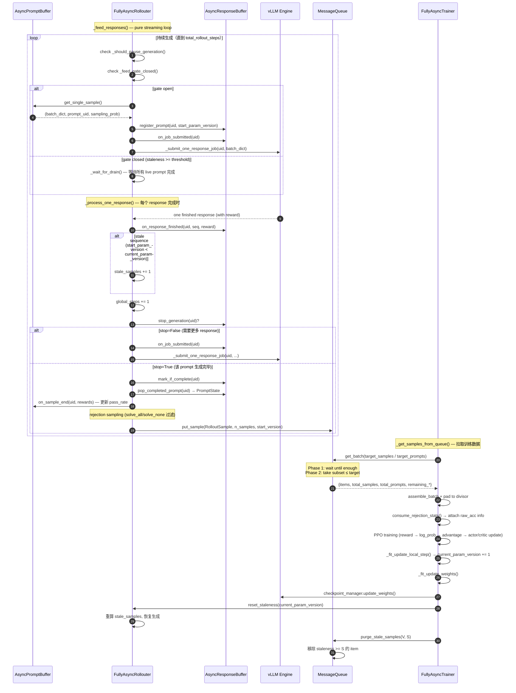
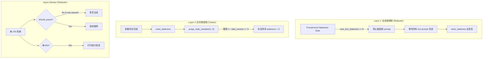

# Fully Async Rollout — 设计与实现说明

> 目录：`verl/experimental/fully_async_policy/`
> 关键组件：`AsyncPromptBuffer` / `AsyncResponseBuffer` / `FullyAsyncRollouter` / `FullyAsyncTrainer` / `MessageQueue`

---

## 1. 设计目标

### 1.1 核心目标：纯流式生成（Pure Streaming Mode）

Rollouter 持续不间断地生成 response，**永不主动停止**，除非遇到以下两种情况：

1. **Prompt-level staleness gate**：当任意一个 live prompt 的 staleness（`current_param_version - start_param_version`）达到 `staleness_threshold` 时，停止抽取新 prompt，等待当前所有 live prompt 生成完毕后再恢复。
2. **Queue 满**：MessageQueue 中的 `pending_samples >= max_queue_size`（trainer 消费速度跟不上）。

### 1.2 关键设计决策

| 维度 | 设计选择 | 理由 |
|------|---------|------|
| **生成模式** | 纯流式：持续从 `AsyncPromptBuffer` 抽取 prompt，无 pool 上限 | vLLM 原生背压 + prompt staleness gate 已足够控制并发 |
| **暂停机制** | 两重门控：① queue 满 ② prompt staleness gate | 移除了冗余的 sequence-count safety belt |
| **Staleness 计数** | 条件 `+= 1`：只有 `start_param_version < current_param_version` 的 sequence 才计入 `stale_samples` | 避免将 fresh sequence 错误计入 staleness |
| **统计粒度** | 双层级：prompt 级和 sample 级统计分开，命名统一 | 不同分析场景需要不同粒度 |
| **Rejection sampling** | 在 Rollouter 侧过滤 | 被拒绝的 prompt 无需序列化/跨进程传输，节省通信开销 |
| **pass_rate 更新** | 每 prompt 一次（emit 时） | 保证 count 只增 1，EMA 应用于完整 reward 集合 |
| **`fixed_rollout_n`** | 锁定到 `rollout.n` | 解耦会静默破坏 GRPO group-size 契约 |
| **`max_rollout_n`** | 单一 source of truth | buffer 硬上限与 adaptive 策略上界共享 |

---

## 2. 架构概览

```
┌─────────────────────────────────────────────────────────────────────┐
│                        FullyAsyncTaskRunner                         │
│  (Ray remote, orchestrates rollouter + trainer + message queue)     │
├─────────────────────────────────────────────────────────────────────┤
│                                                                     │
│  ┌──────────────────────────┐     ┌──────────────────────────┐     │
│  │   FullyAsyncRollouter    │     │    FullyAsyncTrainer     │     │
│  │  (Ray actor, async)      │     │  (Ray actor, async)      │     │
│  │                          │     │                          │     │
│  │  ┌────────────────────┐  │     │  fit_step():             │     │
│  │  │ AsyncPromptBuffer  │  │     │    _fit_generate()       │     │
│  │  │ (prompt selection) │  │     │    _fit_compute_reward()  │     │
│  │  └────────────────────┘  │     │    _fit_compute_log_prob()│     │
│  │  ┌────────────────────┐  │     │    _fit_update_actor()   │     │
│  │  │AsyncResponseBuffer │  │     │    _fit_update_weights() │     │
│  │  │ (stop rule + state)│  │     │                          │     │
│  │  └────────────────────┘  │     └──────────┬───────────────┘     │
│  │           │              │                 │                     │
│  │     ┌─────▼─────┐       │                 │ reset_staleness()   │
│  │     │  vLLM      │       │                 │                     │
│  │     │  Engine(s)  │       │     ┌───────────▼───────────┐        │
│  │     └─────┬─────┘       │     │   CheckpointManager   │        │
│  │           │              │     │  (param sync to vLLM) │        │
│  └───────────┼──────────────┘     └───────────────────────┘        │
│              │                                                      │
│     ┌────────▼────────┐                                            │
│     │  MessageQueue    │◄──── put_sample() ──── rollouter          │
│     │  (Ray actor)     │───── get_batch()  ──── trainer            │
│     └─────────────────┘                                            │
└─────────────────────────────────────────────────────────────────────┘
```

### 组件职责

| 组件 | 职责 |
|------|------|
| `AsyncPromptBuffer` | Prompt 采样（uniform / priority），维护 pass_rate / count，支持 checkpoint |
| `AsyncResponseBuffer` | Per-prompt 状态追踪（in-flight / finished / stopped），stop rule 判定，staleness 计算 |
| `FullyAsyncRollouter` | 流式生成主循环，背压控制，rejection sampling，emit 到 MessageQueue |
| `FullyAsyncTrainer` | 从 MessageQueue 拉样本，PPO 训练，参数同步，purge stale samples |
| `MessageQueue` | Rollouter → Trainer 的异步通信通道，维护 pending_samples 精确计数，支持 staleness purge |
| `FullyAsyncTaskRunner` | 顶层编排：创建组件、同步配置、启动 fit() |

---

## 3. Workflow

### 3.1 完整流程图



### 3.2 关键时序点

1. **Prompt 选择时机**：`_feed_responses()` 在 gate open 时从 `AsyncPromptBuffer` 抽取，严格单条。
2. **pass_rate 更新时机**：每个 prompt 的所有 response 完成后（emit 时）调用一次 `on_sample_end()`，而非每条 sequence 完成时。这保证 count 只增 1，EMA 应用于完整的 reward 集合。
3. **Adaptive rollout_n 生效点**：`RB.stop_generation(uid)` 内部调用 `_resolve_fixed_n(uid)`，后者调用 `_dynamic_fixed_n(uid)` → 读 `PB.meta_data[uid]["pass_rate"]` → `adaptive_rollout_n(pass_rate, base_n, min_n, max_n)`。Per-prompt N 在首次 `stop_generation()` 调用时一次性缓存到 `PromptState.target_n`，生命周期内不再重算。
4. **Rejection sampling 时机**：`_emit_prompt_as_rollout_sample()` 内，**在丢进 message queue 之前**。被拒绝的 prompt 对 trainer 完全不可见。
5. **Padding 时机**：trainer 侧，拉到足够 sequence 后 pad 到 `lcm(ppo_mini_batch_size, world_size)` 的整倍数。
6. **Staleness 计数口径**：`stale_samples` 只计入 `start_param_version < current_param_version` 的 sequence。`reset_staleness()` 在参数同步后精确重算：仅 buffer-resident samples（in-flight + finished_but_not_emitted），不含 queue 中的 samples。
7. **Purge 时机**：`purge_stale_samples()` 在 `reset_staleness()` 之后立即调用，清理 queue 中 `staleness >= S` 的 item，保证下次消费的样本 staleness < S。

---

## 4. 调用链

### 4.1 Rollouter 侧

```
FullyAsyncRollouter.fit()
  ├── _streaming_generation_main()
  │     ├── _feed_responses()                          # 主生成循环
  │     │     ├── _should_pause_generation()            # 背压检查
  │     │     │     ├── queue full?                     # pending_samples >= max_queue_size
  │     │     │     └── _feed_gate_closed()?            # prompt-level staleness gate
  │     │     ├── _wait_for_drain()                     # 等待 live prompt 清空
  │     │     ├── prompt_buffer.get_single_sample()     # 抽取 prompt
  │     │     ├── response_buffer.register_prompt()     # 注册到 response buffer
  │     │     ├── response_buffer.on_job_submitted()    # 标记 in-flight
  │     │     └── _submit_one_response_job()            # 提交第一个 response job
  │     │           └── safe_create_task(_process_one_response())
  │     │
  │     └── _process_one_response(rollout_sample)       # 每个 response 完成时
  │           ├── async_rollout_manager.generate_sequences_single()  # vLLM 生成
  │           ├── response_buffer.on_response_finished()             # 记录完成
  │           ├── [conditional] stale_samples += 1                   # 仅 stale sequence
  │           ├── global_steps += 1
  │           ├── response_buffer.stop_generation()?
  │           │     ├── [False] on_job_submitted() + _submit_one_response_job()  # 继续生成
  │           │     └── [True]  mark_if_complete() + pop_completed_prompt()
  │           │                   ├── prompt_buffer.on_sample_end()   # 更新 pass_rate
  │           │                   └── _emit_prompt_as_rollout_sample()
  │           │                         ├── rejection sampling check
  │           │                         ├── [rejected] rejected_prompts++, rejected_samples++
  │           │                         └── [accepted] message_queue.put_sample(start_version=...)
  │           │                               ├── [success] total_generated_prompts++, total_generated_samples++
  │           │                               └── [fail]    dropped_prompts++, dropped_samples++
  │           └── processed_sample_count += 1
  │
  └── _async_monitor_loop()                             # 并行监控协程
        ├── [每 10s] _should_pause_generation()?
        │     └── [not paused & was paused] → 恢复生成 (condition.notify_all)
        └── [每 60s] get_statistics() → 打印统计信息
```

### 4.2 Trainer 侧

```
FullyAsyncTrainer.fit()
  └── fit_step()
        ├── _fit_generate()
        │     └── _get_samples_from_queue()
        │           ├── message_queue.get_batch(target_samples / target_prompts)
        │           │     ├── Phase 1: wait until pending >= target
        │           │     └── Phase 2: take items where total ≤ target
        │           ├── assemble_batch_from_rollout_samples()
        │           ├── pad_dataproto_to_divisor()       # 补齐到 divisor 整倍数
        │           └── consume_rejection_stats()        # 获取 rejection 统计
        ├── _fit_compute_reward()
        ├── _fit_compute_log_prob()
        ├── _fit_compute_ref_log_prob()
        ├── _fit_compute_critic()
        ├── _fit_compute_advantage()
        │     └── [optional] compute_rollout_correction_and_add_to_batch()  # IS weights
        ├── _fit_update_critic()
        ├── _fit_update_actor()
        ├── _fit_update_local_step()
        │     └── [每 trigger_parameter_sync_step 步] current_param_version += 1
        ├── _fit_update_weights()
        │     ├── checkpoint_manager.update_weights()    # 同步参数到 vLLM
        │     ├── rollouter.reset_staleness(current_param_version)
        │     ├── message_queue.purge_stale_samples(V, S)  # 清理过期样本
        │     └── logger.log(metrics_aggregator.get_aggregated_metrics())
        ├── _fit_dump_data()                             # JSONL rollout data dump
        ├── _fit_validate()
        ├── _fit_save_checkpoint()
        └── _fit_collect_metrics()
              └── compute_batch_training_signal_metrics()  # batch analysis 指标
```

### 4.3 初始化流程

```
FullyAsyncTaskRunner.run()
  └── _initialize_components()
        ├── _create_trainer()        # 先创建 trainer（分配 GPU）
        ├── _create_rollouter()      # 再创建 rollouter
        │     ├── init_workers()
        │     └── set_max_queue_size()
        ├── sync total_train_steps   # rollouter → trainer
        ├── create MessageQueue(config, max_queue_size)
        ├── set_message_queue_client()  # 双向绑定
        ├── load_checkpoint()        # trainer + rollouter
        ├── set_rollouter()          # trainer 持有 rollouter 引用
        ├── _fit_update_weights()    # 首次参数同步
        ├── [optional] _fit_validate(True)  # val_before_train
        └── _run_training_loop()
              ├── rollouter.fit.remote()   # 并行启动
              └── trainer.fit.remote()
```

---

## 5. MessageQueue 设计

### 5.1 核心接口

`MessageQueue` 是一个 Ray remote actor，作为 Rollouter → Trainer 的异步通信通道。

| 方法 | 说明 |
|------|------|
| `put_sample(sample, n_samples, start_version)` | Rollouter 推入一个 RolloutSample（序列化后），附带 sample 数和起始参数版本 |
| `get_batch(target_samples / target_prompts)` | Trainer 拉取一批样本。两阶段：Phase 1 等待足够 → Phase 2 取 ≤ target 的子集 |
| `purge_stale_samples(current_param_version, staleness_threshold)` | 移除 `staleness >= threshold` 的 item |
| `get_statistics()` | 返回 queue_size / pending_samples / total_produced / total_consumed / dropped_samples / max_queue_size |
| `get_pending_sample_count()` | 精确的 pending sample 数（用于 `reset_staleness`） |
| `shutdown()` | 关闭队列，唤醒所有等待的消费者 |

### 5.2 Sidecar Deque 设计

为避免 purge 时反序列化 `ray.cloudpickle.dumps(rollout_sample)` 的开销，MessageQueue 维护三个严格同步的 deque：

| Deque | 内容 | 用途 |
|-------|------|------|
| `queue` | 序列化后的 RolloutSample 数据 | 实际数据存储 |
| `_sample_counts` | 每个 item 包含的 sample 数 | 精确维护 `_pending_samples` 计数 |
| `_start_versions` | 每个 item 的 `start_param_version` | purge 时快速判断 staleness，无需反序列化 |

三个 deque 在 `put_sample` / `get_batch` / `purge_stale_samples` / `clear_queue` 中严格同步操作。

### 5.3 `get_batch` 两阶段协议

```
Phase 1 (wait): 阻塞直到 pending_samples >= target_samples
                （或 queue_size >= target_prompts）
Phase 2 (take): 贪心弹出 item，直到再加一个会严格超过 target
                → 取到的 total ≤ target
                → 剩余 item 留给下一个 training step
Edge case:      如果第一个 item 单独就 > target，强制取一个避免死锁
```

### 5.4 Queue 满时的行为

当 `len(queue) >= max_queue_size` 时，`put_sample` 会 **丢弃最旧的 item**（FIFO eviction），并递增 `dropped_samples` 计数。这是一个 soft cap：Rollouter 侧的 `_should_pause_generation()` 会在 `pending_samples >= max_queue_size` 时暂停生成，所以正常情况下 queue 不会被打满。

---

## 6. 参数配置

### 6.1 核心参数

```yaml
async_training:
  staleness_threshold: 1          # prompt-level staleness 阈值（整数）
  trigger_parameter_sync_step: 1  # 每 N 个 training step 同步一次参数
  require_batches: 1              # 每个 training step 需要的 batch 数
  partial_rollout: true           # 是否允许 partial rollout（跨参数版本）
  use_trainer_do_validate: false  # 是否用 trainer 做 validation

  # Prompt 采样策略
  priority_strategy: null         # null | medium | medium_sharp | hard | ...
  reward_ema: 0.0                 # pass_rate EMA 系数（0.0 = 直接覆盖）
  pass_rate_clip_min: 0.01        # pass_rate 下界裁剪
  pass_rate_clip_max: 0.99        # pass_rate 上界裁剪

  rollout_config:
    # Per-prompt stop rule（5 选 1）
    stop_rule: fixed_rollout      # fixed_rollout | prefixed_rollout
                                  # | has_at_least_positive
                                  # | has_at_least_positive_and_negative
                                  # | max_rollout

    # 所有 stop_rule 共用的硬上限
    max_rollout_n: 32

    # Adaptive rollout_n（仅 stop_rule=fixed_rollout 时生效）
    adaptive_rollout_n_strategy: ""  # medium_focus | constant_positive | uniform | ""(disabled)
    min_rollout_n: 2

    # Training trigger
    train_trigger: fixed_prompt   # fixed_prompt | fixed_samples
    target_samples: null          # fixed_samples 模式的阈值（null = auto）

    # Rejection sampling（rollouter 侧）
    rejection_sampling: false
```

### 6.2 参数派生关系

```
required_samples = ppo_mini_batch_size × rollout.n × require_batches
                   (sequence 级：一个 training step 需要的 sequence 数)

required_prompts = required_samples / rollout.n
                   (prompt 级：用于 fixed_prompt 模式的 target)

max_queue_size = required_samples × (staleness_threshold + 1) × trigger_parameter_sync_step
                 (sequence 级：MessageQueue 容量上限 + 并发 task 数的 clamp 上界)

max_concurrent_samples = min(num_vllm_servers × 32, max_queue_size)
                         (asyncio task 并发上限)

total_rollout_steps = len(train_dataset) × rollout.n × total_epochs
                      (sequence 级：整个训练的 sequence 预算)
                      (可通过 rollout.total_rollout_steps 覆盖)

total_train_steps = total_rollout_steps / (required_samples × trigger_parameter_sync_step)
                    (trainer 侧的总训练步数)
```

---

## 7. Stop Rule 配置矩阵

| 场景 | 配置方式 |
|------|---------|
| 传统 static rollout（每个 prompt 恰好 N 次） | `stop_rule=fixed_rollout` + `rollout.n=N` |
| Adaptive rollout_n（pass_rate 越接近 0.5 分配越多） | `stop_rule=fixed_rollout` + `adaptive_rollout_n_strategy=medium_focus` + `train_trigger=fixed_samples` |
| 早停：有正样本即停 | `stop_rule=has_at_least_positive` |
| 早停：正负样本都有即停 | `stop_rule=has_at_least_positive_and_negative` |
| 按采样概率倒数决定 N | `stop_rule=prefixed_rollout` |
| 仅受硬上限约束 | `stop_rule=max_rollout` |

### 7.1 Adaptive Rollout N 策略

当 `stop_rule=fixed_rollout` 且 `adaptive_rollout_n_strategy` 非空时，per-prompt 的 target N 由 `pass_rate` 动态计算：

| 策略 | 公式 | 特点 |
|------|------|------|
| `medium_focus` | `n = min_n + 4·p·(1-p)·(max_n - min_n)` | 钟形：pass_rate≈0.5 时 N 最大 |
| `constant_positive` | `n = round(base_n / max(p, 1/max_n))` | 保持 E[#positives] ≈ base_n |
| `uniform` | `n = base_n` | 忽略 pass_rate（调试/消融用） |

所有策略的返回值都被 clamp 到 `[min_rollout_n, max_rollout_n]`。Per-prompt N 在首次 `stop_generation()` 调用时一次性缓存到 `PromptState.target_n`，生命周期内不再重算。

---

## 8. Staleness 控制与 Purge 机制

### 8.1 问题背景

异步训练中，样本从生成到被消费存在时间差，导致 **staleness**（样本生成时的参数版本与消费时的参数版本之差）可能无限增大。Staleness 过大会导致 off-policy 偏差，影响训练稳定性。

Staleness 的来源有两层：
1. **生成侧**：prompt 在旧参数下开始生成，生成过程中参数已更新
2. **队列侧**：样本已进入 MessageQueue，但尚未被 trainer 消费，期间参数继续更新

### 8.2 双层控制架构



#### Layer 1：生成侧 — Prompt-level Staleness Gate

**位置**：`FullyAsyncRollouter._feed_gate_closed()` + `_should_pause_generation()`

**机制**：
- `_feed_gate_closed()` 检查所有 live prompt 的最大 staleness（`current_param_version - start_param_version`）
- 当 `max_live_staleness >= staleness_threshold` 时，gate 关闭，停止抽取新 prompt
- `_feed_responses()` 进入 `_wait_for_drain()` 模式，等待所有 live prompt 完成后再恢复
- `reset_staleness()` 被 trainer 调用后，更新 `current_param_version`，唤醒等待的协程
- 当 `staleness_threshold <= 0` 时，gate 始终 OPEN（禁用）

**作用**：控制**新生成样本**的 staleness 上界。

#### Layer 2：队列侧 — Purge Stale Samples

**位置**：`MessageQueue.purge_stale_samples()` + `FullyAsyncTrainer._fit_update_weights()`

**机制**：
- 每个 `put_sample` 调用时，rollouter 传入 `start_version=state.start_param_version`
- MessageQueue 用 sidecar deque `_start_versions` 记录每个 item 的 `start_version`（避免反序列化开销）
- 参数同步后，trainer 调用 `purge_stale_samples(current_param_version, staleness_threshold)`
- 移除所有 `current_param_version - start_version >= staleness_threshold` 的 item
- `start_version == -1` 的 sentinel 永不被清理

**作用**：清理**已在队列中积压**的过期样本，保证下次训练消费的样本 staleness 严格 < S。

#### Async Monitor Loop

**位置**：`FullyAsyncRollouter._async_monitor_loop()`

**机制**：
- 与 `_streaming_generation_main()` 并行运行的独立协程
- 每 10 秒检查一次 `_should_pause_generation()`，如果条件已解除但 rollouter 仍处于 paused 状态，则恢复生成
- 每 60 秒打印一次完整的统计信息（`get_statistics()`）
- 当 `self.running == False` 时退出

**作用**：
1. **恢复触发**：`_feed_responses()` 在 `_wait_for_drain()` 中等待 `condition.notify_all()`，但如果 notify 在 wait 之前发生（race condition），monitor loop 作为兜底机制定期检查并恢复
2. **可观测性**：定期输出 rollouter 的运行状态，便于调试和监控

### 8.3 Staleness 严格保证的证明

设 `staleness_threshold = S`，证明学习侧消费的样本 staleness 严格 < S（即 ≤ S - 1）：

```
时间线：
1. Trainer 完成训练 → _fit_update_local_step() → current_param_version += 1 (变为 V)
2. _fit_update_weights():
   a. checkpoint_manager.update_weights()  → 同步参数到 vLLM
   b. reset_staleness(V)                   → rollouter 更新版本，重算 stale_samples
   c. purge_stale_samples(V, S)            → 移除 queue 中 V - start_version >= S 的 item
      → 存活 item 满足: V - start_version < S，即 staleness ≤ S - 1
3. 下次 _fit_generate() → _get_samples_from_queue():
   - 消费时 current_param_version 仍为 V（直到训练完才 +1）
   - 消费的 item 满足: V - start_version ≤ S - 1
   - 即 staleness = V - start_version ≤ S - 1 < S ✓

结论: 学习侧 staleness 严格 < S（即 ≤ S - 1）
```

**关键不变量**：`current_param_version` 在 `_fit_update_local_step` 中递增，在 `_fit_update_weights` 中同步并 purge，在下一轮 `_fit_generate` 中消费。三者的时序保证了 purge 发生在消费之前，且消费期间版本号不变。

### 8.4 `reset_staleness` 的 stale_samples 重算范围

`reset_staleness()` 调用 `response_buffer.count_stale_samples(current_param_version)` 重算 `stale_samples`，范围仅包括 **buffer-resident samples**（in-flight + finished_but_not_emitted），**不包含** message queue 中的 samples。原因：

1. Trainer 调用 `reset_staleness` **先于** `purge_stale_samples`，此时 queue 中可能有即将被 purge 的 item，包含它们会导致瞬时过计
2. Queue 中合法存活的 samples 的 staleness 在 `[0, staleness_threshold-1]` 范围内，不应膨胀 `stale_samples`
3. Queue 侧的 drop/purge 统计由 `purged_prompts` / `purged_samples` 独立维护

### 8.5 配置参数

```yaml
async_training:
  staleness_threshold: 1    # S：staleness 阈值
                             # 生成侧：live prompt staleness >= S 时停止抽取
                             # 队列侧：queue item staleness >= S 时被 purge
                             # 保证：学习侧消费的样本 staleness < S
```

- `staleness_threshold = 1`（默认）：最严格，只允许当前版本参数生成的样本参与训练
- `staleness_threshold = 2`：允许落后 1 个版本的样本参与训练
- `staleness_threshold = 3`：允许落后 2 个版本的样本参与训练
- `staleness_threshold = 0`：禁用 purge 和 staleness gate（不推荐）

---

## 9. Rejection Sampling

### 9.1 机制

开启 `async_training.rollout_config.rejection_sampling=True` 后，**Rollouter 在 emit 到 MessageQueue 之前** 会丢弃两类无训练信号的 prompt：

- **`solve_all`**：该 prompt 下所有 response 全部答对（reward 全正），group-advantage 为 0
- **`solve_none`**：该 prompt 下所有 response 全部答错（reward 全零/负），group-advantage 同样为 0

仅当 prompt 产生了 **mixed outcome**（部分正确 / 部分错误）且 `total_count >= 2` 时才会被 accept。

### 9.2 Raw Accuracy 修正

由于 Trainer 只看到 accepted 样本，直接统计 accuracy 会 **高估** 模型真实水平。为此 rollouter 会把每个 prompt 的原始 `(correct_count, total_count, sampling_prob)` 通过 `_rejection_reward_info` 一并上报，由 `consume_rejection_stats()` 传递给 trainer，最终由 `compute_raw_acc_with_importance_sampling()` 计算无偏 raw_acc。

### 9.3 统计流

```
Rollouter._emit_prompt_as_rollout_sample()
  ├── 计算 (correct_count, total_count)
  ├── 判断 reject_reason (solve_all / solve_none / "")
  ├── 更新 _rejection_stats (prompt/sample 级计数)
  ├── 追加 _rejection_reward_info (correct, total, sampling_prob)
  └── [accepted] put_sample() / [rejected] return

Trainer._get_samples_from_queue()
  └── consume_rejection_stats.remote()
        ├── 返回 stats + reward_info
        ├── 重置 _rejection_stats 和 _rejection_reward_info
        └── 写入 batch.meta_info["rejection_sampling_reward_info"]
```

---

## 10. Priority Sampling

### 10.1 机制

`AsyncPromptBuffer` 支持基于 `pass_rate` 的优先级采样。当 `priority_strategy` 非 null 时，每个 prompt 的采样权重由 `priority_weight_fn(pass_rate)` 决定。

### 10.2 pass_rate 更新

```
on_sample_end(prompt_uid, reward_scores):
  pass_rate_new = sum(r > 0 for r in rewards) / len(rewards)
  pass_rate = alpha * pass_rate_old + (1 - alpha) * pass_rate_new  # EMA
  pass_rate = clip(pass_rate, clip_min, clip_max)                  # 防止坍缩到 0/1
  row_weights[row_idx] = priority_weight_fn(pass_rate)             # 更新采样权重
```

### 10.3 Checkpoint

`AsyncPromptBuffer.state_dict()` 保存 `generator_state` 和 `meta_data`（pass_rate / count）。`load_state_dict()` 通过 `_merge_meta_data_from_state()` 合并到当前 dataset 的 meta_data 中（只恢复 pass_rate 和 count，row_indices 始终来自当前 dataset）。

---

## 11. 组件接口

### 11.1 `AsyncPromptBuffer`

| 方法 | 说明 |
|------|------|
| `get_single_sample()` → `(batch_dict, prompt_uid, sampling_prob)` | 采样单条 prompt |
| `on_sample_end(prompt_uid, reward_scores)` | 更新 pass_rate / count |
| `get_dataset_info()` → `dict` | 返回 dataset 级别的统计信息 |
| `state_dict()` / `load_state_dict()` | Checkpointing |

### 11.2 `AsyncResponseBuffer`

| 方法 | 说明 |
|------|------|
| `register_prompt(uid, sampling_prob, start_param_version)` | 注册新 prompt |
| `on_job_submitted(uid)` | 标记 in-flight +1 |
| `on_response_finished(uid, sequence, reward)` | 记录完成的 response |
| `stop_generation(uid)` → `bool` | 判断是否停止该 prompt 的生成 |
| `mark_if_complete(uid)` → `bool` | 标记完成并推入待消费队列 |
| `pop_completed_prompt(uid)` → `PromptState` | 拉取已完成的 prompt |
| `max_live_prompt_staleness(current_param_version)` → `int` | 所有 live prompt 的最大 staleness |
| `num_stale_prompts(current_param_version)` → `int` | staleness > 0 的 live prompt 数 |
| `count_stale_samples(current_param_version)` → `int` | buffer 中 stale samples 总数 |
| `num_active_prompts()` → `int` | 注册但未 pop 的 prompt 数 |
| `stats()` → `dict` | 返回 buffer 统计信息 |

### 11.3 `PromptState` 字段

| 字段 | 说明 |
|------|------|
| `in_flight` | 正在生成中的 response 数 |
| `sequences` | 已完成的 response 列表（DataProto） |
| `rewards` | 对应的 reward 列表 |
| `stopped` | 是否已标记停止 |
| `target_n` | 缓存的 per-prompt 目标 N（首次 stop 判定时计算） |
| `start_param_version` | 注册时的参数版本（用于计算 staleness） |
| `sampling_prob` | 采样概率（用于 IS 修正） |
| `is_complete` | `stopped and in_flight == 0` |

### 11.4 `RolloutSample` 字段

| 字段 | 说明 |
|------|------|
| `full_batch` | DataProto，包含生成结果 |
| `sample_id` | 唯一标识 |
| `epoch` | 当前 epoch |
| `rollout_status` | Rollouter 统计快照 |
| `prompt_uid` | Prompt 唯一标识 |
| `sampling_prob` | 采样概率 |
| `rollout_n` | 该 prompt 实际生成的 response 数 |
| `pass_rate` | emit 时的 pass_rate（-1.0 = 未观测） |
| `sample_count` | emit 时的累计采样次数 |

---

## 12. Batch 组装与 Padding

### 12.1 `assemble_batch_from_rollout_samples`

将多个 `RolloutSample` 组装为单个 `DataProto`：

1. 对每个 RolloutSample 调用 `addition_process()` 提取 processing_time / tool_calls 指标
2. `DataProto.concat()` 合并所有 batch
3. 计算 `response_mask`（如果不存在）
4. 收集 partial rollout / prompt buffer / processing time 统计
5. 写入 `meta_info`（prompt_uids, sampling_probs, pass_rates, sample_counts, rollout_ns）

### 12.2 Padding 策略

```
divisor = lcm(ppo_mini_batch_size, actor_world_size)
if len(batch) % divisor != 0:
    batch, pad_size = pad_dataproto_to_divisor(batch, divisor)
    batch["response_mask"][-pad_size:] = 0  # 哑样本，不贡献 loss/梯度
```

Pad 行的 `response_mask` 被强制置零，使其对 loss / 梯度无贡献。整个过程中 list / ndarray 类 `meta_info` 会被临时摘除再恢复，避免 `DataProto.concat` 的等值断言冲突。

---

## 13. Rollout Correction（可选）

当配置了 `algorithm.rollout_correction` 时，trainer 在 `_fit_compute_advantage` 阶段会计算 importance sampling weights：

- **Bypass mode** (`bypass_mode=True`)：`old_log_probs = rollout_log_probs`，PPO ratio = `π_θ / π_rollout`
- **Decoupled mode** (`bypass_mode=False`)：使用 `_compute_old_log_prob()` 重新计算 `π_old`，支持 MIS（Multi-step IS）

支持的 rollout correction 组件：
- `rollout_rs`：Token-level rejection sampling mask（如 `token_k1`）
- `rollout_is`：Importance sampling ratio（如 `token`）

---

## 14. Validation

### 14.1 Rollouter 侧 Validation

Rollouter 的 `_validate()` 方法执行标准的 validation 流程：
- 遍历 `val_dataloader`，对每个 batch 进行 rollout + reward 计算
- 收集 response_length / max_response_length 用于 overlong ratio 计算
- 使用 `enhanced_val_metrics_update()` 计算增强的 validation 指标

### 14.2 Trainer 侧 Validation（`use_trainer_do_validate=True`）

当启用时，trainer 会创建自己的 `colocate_checkpoint_manager` 和 `async_rollout_manager`，在 trainer 的 GPU 上执行 validation。需要 `sleep_replicas()` / `wake_up_replicas()` 来管理 GPU 内存。

### 14.3 Val-only 模式

设置 `trainer.val_only=True` 可以只运行 validation 而不训练。此模式下：
- 只创建 trainer（不需要 rollouter 或 message queue）
- 强制 `use_trainer_do_validate=True`
- 运行 `_validate_process()` 后退出
- 注意：需要设置 `load_format=auto`（而非 `dummy`），否则 vLLM 会使用随机权重

---

## 15. Checkpoint

### 15.1 Rollouter Checkpoint

保存内容：
- `data.pt`：dataloader state_dict
- `prompt_buffer.pt`：AsyncPromptBuffer state_dict（generator_state + meta_data）

恢复时：
- `global_steps` 从 trainer 的 `global_step_N` 反推：`N * required_samples * trigger_parameter_sync_step + 1`
- prompt_buffer 通过 `_merge_meta_data_from_state()` 合并 pass_rate/count

### 15.2 Trainer Checkpoint

由 `SeparateRayPPOTrainer` 基类处理，保存 actor/critic 模型权重和优化器状态。

---

## 16. 命名规范

### 16.1 方法名：sequence → response

Rollouter 侧提交和处理的单元叫 **response**（一个 prompt 的一次生成结果）：

| 方法 | 说明 |
|------|------|
| `_process_one_response` | 处理单个 response 完成 |
| `_submit_one_response_job` | 提交单个 response 生成任务 |
| `_feed_responses` | 主生成循环 |

### 16.2 计数变量：对齐 trainer 的 samples 单位

| 变量 | 层级 | 累加时机 |
|------|------|---------|
| `total_generated_prompts` | prompt | emit 成功时 +1 |
| `total_generated_samples` | sample | emit 成功时 += num_finished |
| `stale_samples` | sample | 完成 stale sequence 时 +1 |
| `stale_prompts` | prompt | 实时计算（`response_buffer.num_stale_prompts()`） |
| `dropped_prompts` | prompt | put_sample 失败时 +1 |
| `dropped_samples` | sample | put_sample 失败时 += num_finished |
| `rejected_prompts` | prompt | rejection sampling 丢弃时 +1 |
| `rejected_samples` | sample | rejection sampling 丢弃时 += total_count |

---

## 17. 文件结构

```
verl/experimental/fully_async_policy/
├── fully_async_main.py          # 入口：FullyAsyncTaskRunner 编排
├── fully_async_rollouter.py     # FullyAsyncRollouter（Ray actor）
├── fully_async_trainer.py       # FullyAsyncTrainer（Ray actor）
├── message_queue.py             # MessageQueue + MessageQueueClient
├── detach_utils.py              # RolloutSample / assemble_batch / MetricsAggregator
├── agent_loop/                  # FullyAsyncAgentLoopManager
├── config/                      # Hydra YAML 配置
├── shell/                       # 启动脚本
├── utils/
│   ├── async_prompt_buffer.py   # AsyncPromptBuffer + adaptive_rollout_n 策略注册
│   ├── async_response_buffer.py # AsyncResponseBuffer + PromptState
│   ├── batch_metrics.py         # batch-level 训练信号分析
│   ├── filter_zero_adv.py       # GRPO zero-variance group masking
│   ├── priority_sampling.py     # Priority weight functions
│   ├── parallel_validation_metrics.py  # Enhanced validation metrics
│   └── reward_fn.py             # Custom reward function
├── metrics.md                   # 指标说明文档
├── ASYNC_ROLLOUT.md             # 本文档
└── README.md                    # 项目概述
```
